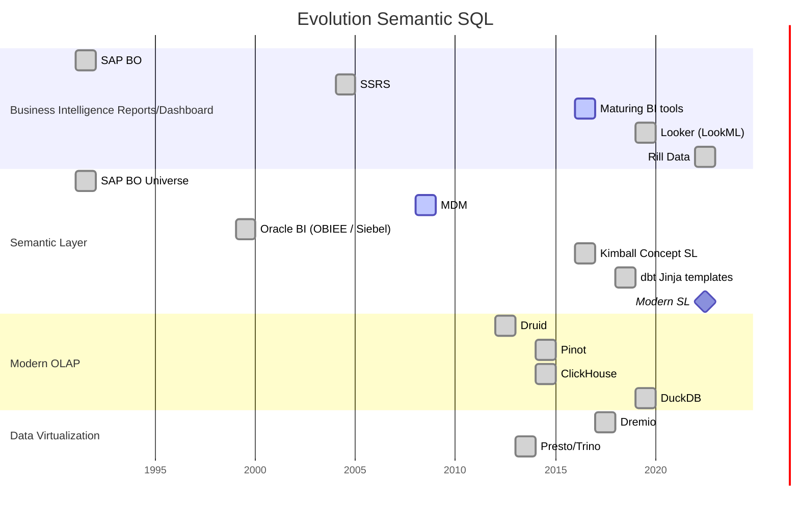

Semantic SQL ရဲ့ သမိုင်းကြောင်း
Busniess Intelligence (BI) နဲ့ ပတ်သတ်ရင် reports တွေ အများကြီး လုပ်ခဲ့ကြပါတယ်။ ဒါပေမယ့် BI ရဲ့ နောက်ကွယ်မှာ ရှိနေတဲ့ Pattern က ဘာလဲ? Semantic layer ဆိုတာက ဘာကြောင့် BI နဲ့ ပုံစံတူ ဖြစ်နေရတာလဲ? ဒီ chapter မှာ အဲဒီအကြောင်းကို ရှာဖွေ ဆွေးနွေးသွားမှာ ဖြစ်ပါတယ်။

ပထမဆုံး သုံးနှုန်းခဲ့တဲ့ terms တွေရဲ့ ပြောင်းလဲပုံနဲ့ ပတ်သတ်ပြီး အောက်ပါ diagram ကို ကြည့်ရှုပါ။ Chart မှာ အသုံးပြုထားတဲ့ dates တွေကို wikipedia ကနေ ရယူထားပါတယ်။

# Business Intelligence Dashboard / Report

BI နဲ့ ပတ်သတ်ပြီး ၎င်းနဲ့ သက်ဆိုင်တဲ့ product, dashboard နဲ့ report တွေအကြောင်း အရင်ဆွေးနွေးရအောင်။

### အဓိပ္ပါယ်ဖွင့်ဆိုချက် (Definition)

Business Intelligence စနစ်တစ်ခုက စီးပွားရေးလုပ်ငန်း(သို့)အဖွဲ့အစည်းတစ်ခု ကို ခြုံငုံသုံးသပ်နိုင်တဲ့ အမြင် ဖြစ်အောင်၊ လုပ်ငန်းရဲ့ လုပ်နိုင်စွမ်းကို မြှင့်နိုင်အောင် ၊ ထပ်တလဲလဲ ပြုလုပ်နေရတဲ့ အလုပ်တွေကို automate အလိုအလျောက်ဖြစ်အောင် ပြောင်းလဲပေးနိုင်ရပါမယ်။ အသေးစိတ် အနေနဲ့ 

- ==Roll-up capability== - အလွန်အရေးကြီးတဲ့ [KPIs](https://www.ssp.sh/brain/kpi/) (aggregations - လုံးပေါင်း) အချက်အလက် ဒေတာကို အခြေခံတဲ့ visualization ဖြစ်တဲ့အတွက် လေယာဥ်ထိန်းချုပ်ခန်းလိုမျိုးပဲ တစ်ချက်ကြည့်ရုံနဲ့ လိုအပ်တဲ့ အချက်အလက်များကို သင့်ဆီ ထောက်ပံ့ပေးရပါမယ်။
- ==Drill-down possibilities== - အပေါ်မှာ ပြောခဲ့သလို High-level overview ကနေတဆင့် စီစဥ်ထားတဲ့အတိုင်း ဖြစ်မြောက်ခြင်းမရှိတဲ့ / ထူးခြားမှု ရှိနေတဲ့ အပိုင်း တွေ့ရှိခဲ့တဲ့အခါ အသေးစိတ်ကို ထပ်မံသိရှိဖို့ လိုလာပါတယ်။ ဒီအတွက် သင့်မှာ ရှိတဲ့ ဒေတာကို အမျိုးမျိုးသော ရှုထောင့်တွေကနေ ပိုင်းခြား ၊ ခွဲစိတ် ၊ ပြောင်းလဲ မှုတွေ ပြုလုပ်ဖို့ လိုပါတယ်။ (ဒေတာတွေကို အမျိုးမျိုး ကစားကြည့်ပြီး ပြဿနာအရင်းအမြစ်ကို ရှာဖွေကြည့်ဖို့ပါ)
* ==Single source of truth== - Spreadsheets ပေါင်းစုံ ၊ Database Tools ပေါင်းစုံမှာ ဒေတာတွေ ပြန့်ကြဲနေမယ့်အစား process တစ်ခုလုံးကို automated အလိုအလျောက်ဖြစ်အောင် ပြုလုပ်ပီး တစ်နေရာထဲမှာ စုစည်းဖို့ပါ။ ဒါဆိုရင် ဝန်ထမ်းများအနေနဲ့ အချင်းချင်းအကြား ကွဲလွဲနေတဲ့ ဒေတာတွေအကြောင်း ပြောစရာမလိုတော့ပဲ စီးပွားရေးအရ/လုပ်ငန်းလိုအပ်ချက်အရ ပြဿနာများကိုပဲ အာရုံစိုက်လို့ ရလာမှာပါ။ လိုအပ်တဲ့ Reporting , Budgeting နဲ့ Forecasting တွေအားလုံးက မှန်မှန်ကန်ကန် တိတိကျကျ နဲ့ အမြဲတစေ အလိုအလျောက် update ပြုလုပ်နေမှာ ဖြစ်ပါတယ်။
* ==Empower users== - နောက်ပိုင်းမှာ User တွေအနေနဲ့ BI သမားတွေ ၊ IT သမားတွေပေါ် မှီခိုစရာမလိုတော့ပဲ မိမိဘာသာ ဒေတာများကို ခွဲခြား စိတ်ဖြာပြီး အသုံးပြုနိုင်တဲ့ BI service မျိုး ဖြစ်လာပါမယ်။ 

### အချိန်ကာလအလိုက် ပြောင်းလဲလာမှု (History & Evolution)

သင့်အနေနဲ့ ဒေတာပိုင်းဆိုင်ရာ အလုပ်တွေမှာ အချိန်အတော်ကြာ လုပ်ဖူးတယ်ဆိုရင် Tableau , PowerBI , Metabase စသဖြင့် အသုံးများတဲ့ BI Tools တွေ အကြောင်း ကြားဖူးပါလိမ့်မယ်။ 