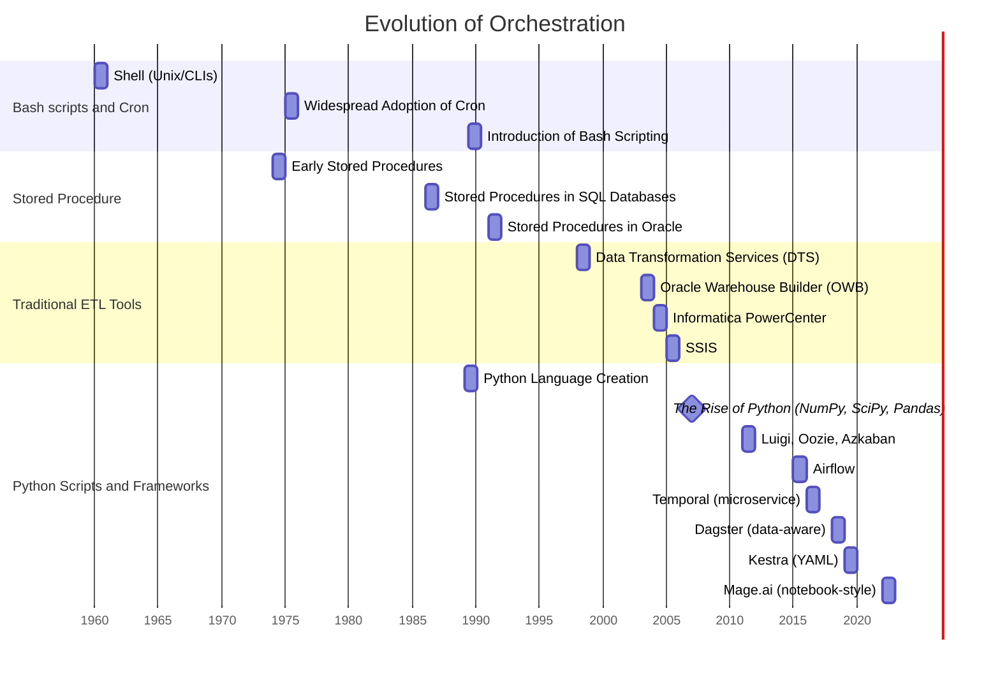

> Data Engineering Design Patterns စာအုပ်မှ [အခန်းတစ်ခန်း ](https://dedp.online/part-2/4-ce/bash-stored-procedure-etl-python-script.html)ကို မှီးငြမ်း ဘာသာပြန်ဆိုထားပါသည်။


Data နဲ့ ပတ်သတ်လို့ Orchestrator (ဒေတာ သံစုံတီးဝိုင်းလို့ မြန်မာမှု ပြုလို့ရမယ်) အကြောင်း ပြောမယ်ဆိုရင် နည်းပညာ ခက်ခဲ ရှုပ်ထွေးတယ်လို့ မြင်ကြပါတယ်။ Cron ဆိုတာဘာလဲ ၊  Python Script က ဘာအတွက် သုံးတာလဲ ၊ Bash Script ဆိုတာ ဘယ်လိုမျိုးလဲ ၊ အစောပိုင်းတွေ အသုံးချခဲ့တဲ့ Stored Procedure (SSIS) ဆိုတာ ဘာလဲ စသဖြင့် မေးခွန်းပေါင်းစုံ ရှိလာနိုင်ပါတယ်။ ဒီ ဆောင်းပါးမှာတော့ ဒေတာနဲ့ ပတ်သတ်တဲ့ tasks တွေကို orchestrate (သံစုံ တီးဝိုင်းလိုမျိုး စနစ်တကျ စီမံခန့်ခွဲပေးနိုင်တဲ့) ယေဘုယျနည်းလမ်းတွေ အကြောင်း ဆွေးနွေးသွားမှာ ဖြစ်ပါတယ်။ 



### Bash Script and Cron

Bash script ကတော့ ရှေးဦးပိုင်း orchestration version လို့ ပြောလို့ ရပါတယ်။ မိမိ လုပ်ဆောင်လိုတဲ့ task (သို့မဟုတ်) transformation တွေအတွက် သက်ဆိုင်တဲ့ အရာအားလုံးကို စုစည်းပေးနိုင်ပါတယ်။ File တစ်ခု ကို ဖွင့်လိုက်ပြီး filename ကို `.sh` extension နဲ့ သိမ်းလိုက်မယ်။ ပြီးတော့ file အတွင်း ပထမဆုံး စာကြောင်း အနေနဲ့ `#!/bin/bash` (သို့) အခြားကြိုက်နှစ်သက်ရာ shell အမျိုးအစားကို ရေးသားလိုက်ပြီးပြီဆိုရင် သင့်အနေနဲ့ စတင်ဖို့ ready ဖြစ်ပါပြီ။

Bash script တွေနဲ့အတူ တွဲသုံးလေ့ ရှိတာကတော့ Cron နဲ့ ၎င်းရဲ့ cron jobs တွေ ဖြစ်ပါတယ်။ Unix system မှာ လုပ်ဆောင်ချက်တစ်ခုကို schedule ပြုလုပ်ဖို့အတွက် command  (သို့) script တစ်ခုထဲမှာ ရိုးရိုးရှင်းရှင်းပဲ ထည့်သုံးလို့ ရပါတယ်။ ဥပမာ - `0 8 * * *` ဆိုတဲ့ cron expression တစ်ခုက မိမိ လုပ်ဆောင်လိုတဲ့ job တစ်ခုကို နေ့စဥ် မနက် ၈ နာရီမှာ run ဖို့အတွက် schedule ပြုလုပ်ရာမှာ အသုံးပြုတာ ဖြစ်တယ်။ 

### Bash နဲ့ Shell အကြား ခြားနားချက်

Shell scripts တွေက Operating System တစ်ခုရဲ့ command-line interpreter (သို့) shell တစ်ခုအတွက် ရေးသားတဲ့ script တွေ ဖြစ်ပါတယ်။ Shell script က ပိုပြီး ယေဘုယျဆန်ပြီး ရေးထားတဲ့ script တွေကို နှစ်သက်ရာ shell (ဥပမာ - sh, csh, ksh, စသဖြင့်) မှာ အသုံးချနိုင်ပါတယ်။

Bash (အရှည်ကောက် - Bourne Again SHell) scripts တွေကတော့ original shell ထက် ပိုပြီး feature တွေ စုံအောင် ပြုပြင်ထားတဲ့ Bash shell အတွက် ရေးသားတာပါ။ Bash မှာ အခြေခံ shell scripts တွေထက် ပိုပြီး standard ကျတဲ့ variable handling တွေ ၊ သင်္ချာလုပ်ဆောင်ပုံတွေ စသဖြင့် အဆင့်မြင့်တင်ထားတာတွေ ပါဝင်ပါတယ်။

#### Complex Bash Script ဥပမာ 
ဒီ script က အဓိကအားဖြင့် database environment တစ်ခုအတွင်းက files တွေကို ကိုင်တွယ်ဖို့အတွက် ရေးသားထားတာပါ။

```bash
#!/bin/bash

# Initialize variables
application='DEFAULT_APP'
job_status='OK'

# Parse arguments
for arg in "$@"; do
  key=$(echo $arg | cut -d= -f1)
  value=$(echo $arg | cut -d= -f2)
  case $key in
    GRP) ascii_group=$value ;;
    DAT) date=$value ;;
    SYS) system=$value ;;
    SRV) server=$value ;;
    APP) application=$value ;;
  esac
done

# Check mandatory parameter (Group)
if [ -z "$ascii_group" ]; then
  echo "Error: Group parameter is missing."
  exit 1
fi

# Database Interaction (Simplified)
# Assuming a function `query_database` exists for database interaction
work_date=$(query_database "SELECT TO_CHAR(work_date, 'YYMMDD') FROM system_table;")
if [ $? -ne 0 ]; then
  echo "Database query failed."
  exit 1
fi
date=${date:-$work_date}

# Processing ASCII files (Simplified)
echo "Processing started with the following parameters:"
echo " - Group:   $ascii_group"
echo " - Date:    $date"
[ -n "$system" ] && echo " - System:  $system"
[ -n "$server" ] && echo " - Server:  $server"
[ -n "$application" ] && echo " - App:     $application"

# Retrieving ASCII files (Example query)
ascii_files=$(query_database "SELECT file_name FROM ascii_files WHERE group_name = '$ascii_group';")
if [ $? -ne 0 ]; then
  echo "Error retrieving ASCII files."
  exit 1
fi

# Process each ASCII file
for file in $ascii_files; do
  echo "Processing file: $file"
  # File processing logic goes here (e.g., compression, moving, SQL execution)
done

echo "Processing completed."

# Finalization
# Additional cleanup or final steps can be added here
```

#### Key Components
အပေါ်က script ရဲ့ လုပ်ဆောင်ချက် နဲ့ ကန့်သတ်ချက်တွေကို အောက်ပါအတိုင်း အနှစ်ချုပ်လို့ ရနိုင်ပါတယ်။

1. Initialisation - script ကို မှန်ကန်စွာ ခေါ်ဆို အသုံးပြုခြင်း နဲ့ env variables များ set up ပြုလုပ်ခြင်း ကို  စစ်ဆေးခြင်း။
2. Parameter Validation : 1. Parsing argument and processes command-line arguments to set various parameters. Ensures the essential parameters are provided. If not, it logs an error and exits.
3. . **Database Interaction**: Connecting to a database using `sqlplus` and retrieving the work date. Checks for errors and exits if any issues are encountered.
4. File processing:
    1. **File Archiving and Preprocessing**: Archives older versions of files and prepares new files for processing.
    2. **SQL Command Execution**: Generates SQL commands to be executed for each file, handles its errors, and logs them if necessary.
    3. **Sub-process Execution**: Executes generated SQL commands in sub-processes and waits for all sub-processes to finish before proceeding.
5. **Post-Processing Checks**: Verifies the output of each sub-process for errors, concatenates parts of split files if needed, and handles disk space errors.
6. **File Distribution**: Prepares files for different hosts and executes another script for FTP distribution.
7. **Finalization**: Running another script for job completion tasks.

ဒီ script ကို ကြည့်ရှုခြင်း အားဖြင့် အစဦးပိုင်းအချိန်တွေမှာ orchestration ကို မည်သို့ ပြုလုပ်ခဲ့သလဲဆိုတာ မြင်သာပါလိမ့်မယ်။ scheduling , parameter handling, database interaction, file processing နဲ့ error handling ကဲ့သို့ မတူညီတဲ့ task ပေါင်းစုံကို Script တစ်ခုထဲနဲ့ ကိုင်တွယ်သွားတာပါ။ ယခု နောက်ပိုင်း ထွက်ပေါ်လာတဲ့ ခေတ်သစ် orchestration tools တွေမှာတော့ ပိုမိုကောင်းမွန်ပြီး စွမ်းဆောင်ရည်ပြည့်ဝတဲ့ functions တွေ ပိုမို ပါဝင်လာပါပြီ။ 


### အချိန်ကာလအလိုက် ပြောင်းလဲလာမှု (History & Evolution)

Unix Operation System တွေရဲ့ အစောပိုင်း ကာလတွေမှာ သေးငယ်ပြီး မတူကွဲပြား များပြားလှတဲ့ libraries လေးတွေက ကွန်ပျူတာတစ်လုံးထဲမှာ စုထည့်ထားသလို ဖြစ်နေပါတယ်။ ဒီအတွက် အလုပ်လုပ်ဖို့ရာ ပိုမို ရှုပ်ထွေးလာပြီး tasks တွေကို workflow အဖြစ် စီမံခန့်ခွဲဖို့ နည်းလမ်းတွေ လိုအပ်လာပါတယ်။ Bash scripts တွေက ဒီပြဿနာ ကို ဖြေရှင်းဖို့ design ဆွဲခဲ့တာ မဟုတ်ပေမယ့် အဲဒီကာလမှာတော့ သူက လွဲပြီး သုံးစရာ မရှိခဲ့ပါဘူး။ 

Unix Operating System တွေ မွေးဖွားလာတဲ့ 1960 ခုနှစ် နဲ့ 1970 အစောပိုင်းကာလတွေမှာ ပထမဦးဆုံးသော Shell (Bourne shell `sh`) နဲ့ command-line interface (CLI) ကို စတင် မိတ်ဆက်ခဲ့ပါတယ်။ အဲဒီနောက်မှာ Bourne shell ကို ပိုမိုကောင်းမွန်အောင် ပြုပြင်ထားတဲ့ version ဖြစ်တဲ့ Bash (Bourne Again SHell) ကို 1989 မှာ မိတ်ဆက်ခဲ့ပြီး system administration နဲ့ task automation တွက် အသုံးများလာခဲ့ပါတယ်။ Bash အနေနဲ့ ပိုမိုကောင်းမွန်တဲ့ စွမ်းဆောင်ရည် နဲ့ ရိုးရှင်းမှုကို တပြိုင်နက် ထောက်ပံ့ပေးနိုင်ခဲ့ပါတယ်။ Scripting Language ကို Command-line utilities တွေနဲ့ တွဲသုံးခြင်းအားဖြင့် အရေးကြီးတဲ့ အလုပ်တွေကို ဖြေရှင်းဖို့အတွက် ဖြစ်နိုင်ချေများစွာကို ဖော်ထုတ်ပေးနိုင်ခဲ့ပါတယ်။

- a
	* testing
- b
- c

